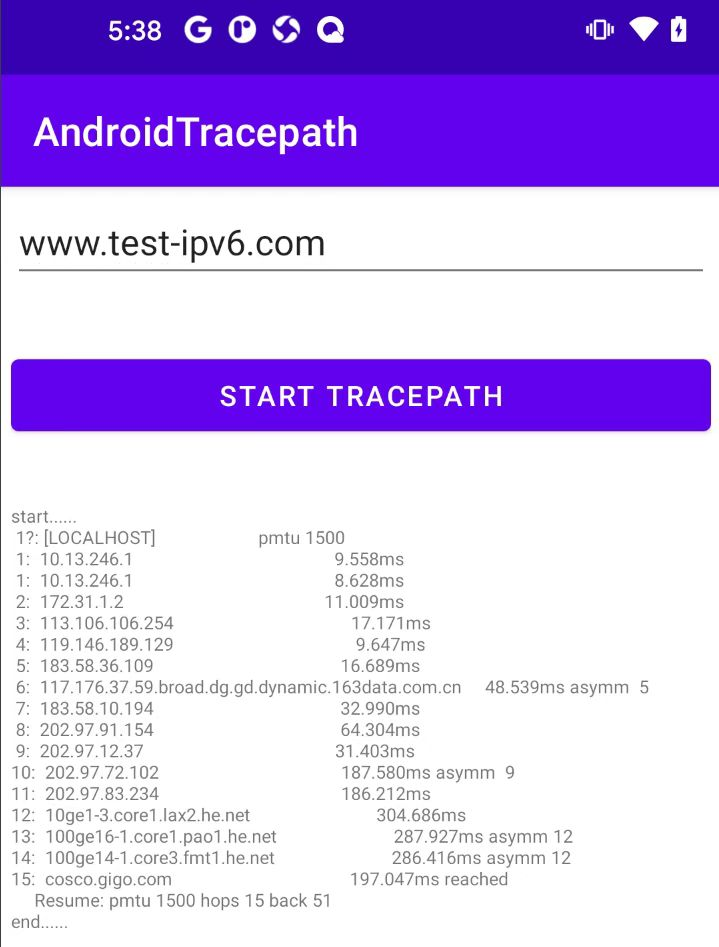

# android-tracepath

[](https://jitpack.io/#yanbober/android-tracepath)

一个网络追踪并显示报文到达目的主机所经过的路由信息库，基于 platform/external/iputils/tracepath6.c 移植定制，无需特殊权限，兼容完美，适用于 Android 应用程序。



# 开始使用

在你项目根目录的`build.gradle`中添加如下仓库依赖，如下：

```gradle
allprojects {
    repositories {
        ...
        maven { url 'https://jitpack.io' }
    }
}
```

在你项目模块中添加库依赖，如下：

```gradle
dependencies {
    //Tag取值为版本号
    implementation 'com.github.yanbober:android-tracepath:Tag'
}
```

在你的混淆配置文件中添加如下配置：

```txt
-keep public class cn.yan.android.tracepath.AndroidTracePath { *; }
```

在你需要使用的地方调用 API 即可（建议非 UI 线程调用），如下：

```java
new Thread() {
    @Override
    public void run() {
        AndroidTracePath androidTracePath = new AndroidTracePath(new AndroidTracePath.StateListener() {
            @Override
            public void onStart() {
                //开始探测
            }

            @Override
            public void onUpdate(String update) {
                //探测状态实时回调，每级路由
            }

            @Override
            public void onEnd() {
                //探测结束回调
            }
        });
        androidTracePath.startTrace("your hostname");
    }
}.start();
```

# tracepath

Linux 的 tracepath 指令可以追踪数据到达目标主机的路由信息，同时还能够发现 MTU 值。它跟踪路径到目的地，沿着这条路径发现 MTU。它使用 UDP 端口或一些随机端口。它类似于 Traceroute，只是不需要超级用户权限，并且没有花哨的选项。

移植到 Android 应用层使用的 android-tracepath 库与 Linux 直接执行 tracepath 指令的输出结果格式类似，具体含义参见 tracepath 命令。